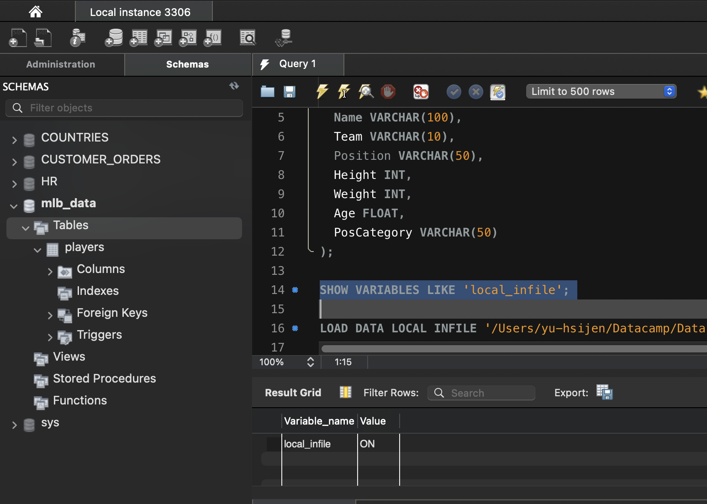
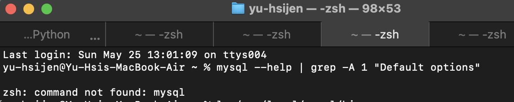

# 📓 How to Connect to MySQL from Python

A step-by-step guide to:

- Fix MySQL CLI on macOS
- Load a CSV into MySQL using `LOAD DATA`
- Connect to MySQL using Python + SQLAlchemy + Pandas
- Troubleshoot common problems like `local_infile`

---

## 🧩 Prerequisites

- ✅ MySQL Server installed (DMG or Homebrew)
- ✅ Python 3.x
- ✅ Jupyter Lab or Notebook
- ✅ Python packages:
  - `sqlalchemy`
  - `pymysql`
  - `pandas`
- ✅ A CSV file named `MLB.csv`
- ✅ A database called `mlb_data` with a table called `players`

---

## ⚙️ Install Required Python Packages

```bash
pip3 install sqlalchemy pymysql pandas
```

❓ Problem: mysql Command Not Found

⚡️ Cause

MySQL is installed, but your terminal can’t find it. The CLI binary isn’t in your system's PATH.

✅ Fix: Add MySQL to PATH on macOS

Open terminal:

```bash
nano ~/.zshrc
```
Add this line at the bottom:
```bash
export PATH="/usr/local/mysql/bin:$PATH"
```
Save and apply:
```bash
source ~/.zshrc
```
Confirm:
```bash
mysql --version
```
Output should look like:
```bash
mysql  Ver 8.0.xx for macos on arm64
```
💡 Create MySQL Table and Load Data

📂 SQL to Create Table
```sql
CREATE DATABASE mlb_data;
USE mlb_data;

CREATE TABLE players (
  Name VARCHAR(100),
  Team VARCHAR(10),
  Position VARCHAR(50),
  Height INT,
  Weight INT,
  Age FLOAT,
  PosCategory VARCHAR(50)
);
```
📂 SQL to Load CSV
```sql
LOAD DATA LOCAL INFILE '/Users/yu-hsijen/Datacamp/Data Engineer in Python/sample data/prereq01_Introduction_To_Python/MLB.csv'
INTO TABLE players
FIELDS TERMINATED BY ','
ENCLOSED BY '"'
LINES TERMINATED BY '\n'
IGNORE 1 ROWS;
```
⚠️ Problem: local_infile Disabled

Error
Error Code: 3948. Loading local data is disabled

✅ Fix: Enable local_infile in MySQL Server

Find your config file:
```bash
mysql --help | grep -A 1 "Default options"
```
Create or edit /etc/my.cnf:

Add this section:

[mysqld]
local_infile=1

Restart MySQL:

Via System Preferences > MySQL: Stop and Start

Confirm:
```sql
SHOW VARIABLES LIKE 'local_infile';
```
Output:

+---------------+-------+
| local_infile  | ON    |
+---------------+-------+

📊 Load Table into Pandas

import pandas as pd
from sqlalchemy import create_engine

engine = create_engine("mysql+pymysql://root:<your_password>@localhost:3306/mlb_data")
df = pd.read_sql("SELECT * FROM players", con=engine)
print(df.head())

🖼️ Screenshots



![Terminal PATH Fix]


## ✅ Summary

- Fix missing MySQL CLI on macOS  
- Enable `LOAD DATA LOCAL INFILE`  
- Load CSVs into MySQL  
- Use SQLAlchemy + Pandas to read from MySQL in Jupyter
